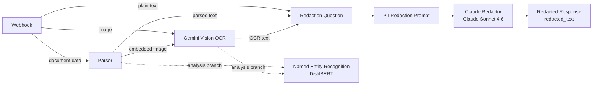

# PrivacyShield

PrivacyShield is a document-privacy workflow built with RocketRide. It accepts plain text or document/image input, extracts readable content when OCR is needed, and returns a sanitized version with personally identifiable information replaced by `[REDACTED]`.

I originally built PrivacyShield as a small local proof of concept. After getting that working, I moved the project to RocketRide Cloud and rebuilt the OCR and redaction path around Gemini Vision and Claude. The current version is the cloud pipeline shown below.

## Current architecture



The important design choice is that Named Entity Recognition stays on a separate analysis branch. The final redaction path works directly with the text coming from the webhook, parser, or Gemini OCR instead of routing NER output into the response path.

## How it works

PrivacyShield supports two main input paths.

For plain text, the webhook can pass the text into the redaction flow directly. For images or document content that needs OCR, Gemini Vision first transcribes the visible text. The extracted text is then converted into the question format expected by the prompt and passed to Claude for redaction.

The redaction prompt asks Claude to mask sensitive values such as names, email addresses, phone numbers, street addresses, Social Security numbers, dates of birth, financial identifiers, passport or driver-license numbers, IP addresses, and other clearly sensitive identifiers. Sensitive values are replaced with `[REDACTED]` while the surrounding wording and useful line breaks are preserved as closely as possible.

The final Response node exposes the sanitized result as `redacted_text`.

## Main components

| Component | Role |
| --- | --- |
| **Webhook** | Entry point for text and image/document input |
| **Parser** | Extracts text and embedded media from incoming document data |
| **Gemini Vision OCR** | Extracts readable text from images using `gemini-3_1-pro-preview` |
| **Named Entity Recognition** | Runs DistilBERT entity analysis as a separate branch |
| **Redaction Question** | Converts extracted text into the question stream used by the prompt |
| **PII Redaction Prompt** | Defines what should be treated as sensitive and how the output should be formatted |
| **Claude Redactor** | Performs the final redaction using Claude Sonnet 4.6 |
| **Redacted Response** | Returns the sanitized result under `redacted_text` |

The NER node currently uses a minimum confidence of `0.85` and stores detected entities in metadata. It is useful for analysis, but it does not control the final redacted response.

## Pipeline file

The current cloud pipeline is:

```text
privacyshield-final-gemini-claude-v2.pipe
```

The model credentials are referenced through environment variables rather than hard-coded API keys:

```text
ROCKETRIDE_GEMINI_KEY
ROCKETRIDE_ANTHROPIC_KEY
```

Do not commit generated endpoint credentials, task tokens, or real API keys.

## Project evolution

The first version of PrivacyShield was a local RocketRide proof of concept built around Parser, EasyOCR, BERT/GLiNER-based analysis, a PII Anonymizer, and a Response node.

During that version I found a duplicate-output problem after routing NER output into the anonymizer. RocketRide's Trace view made the issue clear: text was being repeated between stages. I changed the design so entity recognition remained a separate analysis branch and the redaction path received the extracted text directly.

When I moved the project to RocketRide Cloud, the original model-based anonymizer and legacy OCR path were not reliable in that environment. I rebuilt the cloud version around Gemini Vision OCR and Claude redaction instead of trying to force the local implementation to behave the same way in Cloud.

That change also made the responsibilities of the pipeline clearer: OCR extracts text, NER analyzes it independently, and Claude handles the final sanitization.

## Testing

I tested the current cloud pipeline with a fictional patient-intake image containing deliberately fake PII.

The test document includes examples such as a patient name, email address, phone number, street address, Social Security number, and date of birth. Gemini Vision extracted the text from the image and the Claude redaction path returned a sanitized version with those values replaced by `[REDACTED]`.

The sample file is included in:

```text
demo/privacyshield-ocr-test.png
```

For a running RocketRide task, I used the RocketRide upload command:

```bash
rocketride upload \
  --token "$RR_TASK_TOKEN" \
  ./demo/privacyshield-ocr-test.png
```

The test data in this repository is fictional and is intended only for OCR and PII-redaction validation.

## Demo

### Pipeline


### OCR test input


### Redacted output


### Video walkthrough

[Watch the PrivacyShield demo on YouTube](https://youtu.be/JusZOfXtvbo)

## Open-source contribution

While building PrivacyShield, I also worked on [rocketride-server issue #1453](https://github.com/rocketride-org/rocketride-server/issues/1453), which covers unprotected `sessionStorage` access in browser environments where storage can be blocked or throw an exception.

I submitted [PR #2385 — `fix(ui): guard sessionStorage access in privacy-restricted browsers`](https://github.com/rocketride-org/rocketride-server/pull/2385).

The change adds safe `sessionStorage` helpers and applies them to authentication/bootstrap and PKCE-related paths so restricted storage access can fail harmlessly instead of crashing application startup. Regression coverage was also added for normal storage behavior and failure cases.

The pull request is currently under review.

## Next step: RocketRide App

The working cloud pipeline is the backend of PrivacyShield. The next stage is to package it as a RocketRide App with a small user-facing interface for submitting text or documents and viewing the redacted result.

That App version will keep the pipeline focused on the processing work while the UI handles input, progress, and result presentation. After the app is packaged and verified, the goal is to submit a version through RocketRide's App publishing/review flow.

## What I would improve next

PrivacyShield is still a proof of concept, not a production system for real sensitive data. The next improvements I would focus on are:

- add deterministic validation for structured identifiers such as email addresses and SSNs
- build a larger evaluation set across different document layouts and scan quality
- measure false positives and missed detections
- test rotated, low-resolution, and noisy document images
- add automated regression cases for the redaction prompt
- build the RocketRide App interface around the working cloud pipeline
- add clearer handling for unsupported files and model/API failures

One lesson from this project is that a privacy workflow should not depend on a single model behaving perfectly. A production version should combine model-based detection with deterministic checks, evaluation, and clear failure handling.
